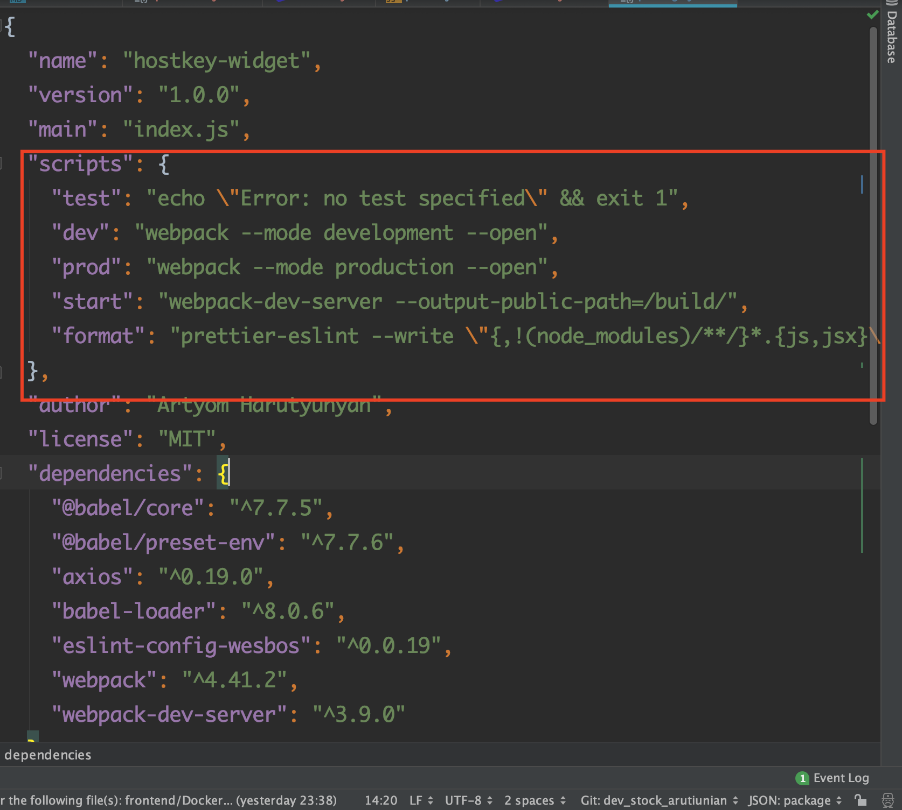
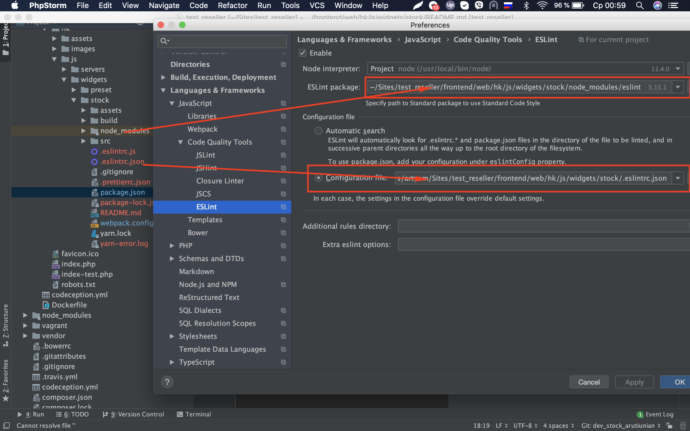

Документаця по widget - у 

#Установка 
- [1] npm install или yarn install
- [2] для сборки проекта используем коммаду npm run dev или yarn run dev так же можно использовать prod для сборки на production
- [3] все команды можно посмотреть в файле package.json - е поле scrips

#Правила

- [1] используем только Es7 синтаксис
- [2] над каждым методом, пишем документацию 

#Текстовый Редактор

- [1] в объязательном порядке нужну установить к себе в редактор eslint 
при этом настраиваем путь к config  файлам .eslintrc.json, так же к самому модулю в node_modules,
ниже прикрепляю скрин

#Фроматирование кода

- [1] для форматирования кода используем команду
  "yarn run format"
